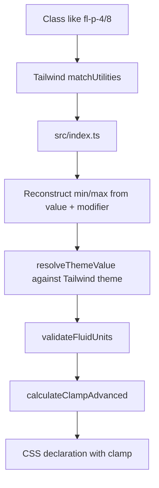

# Architecture

## Project Purpose

`fluid-tailwindcss` is a TypeScript package that registers Tailwind CSS utilities for fluid responsive values. It generates CSS `clamp()` declarations from class names such as `fl-p-4/8`, supports Tailwind CSS v4 plugin usage, and exposes a `tailwind-merge` integration for resolving conflicts between fluid and standard Tailwind classes.

The repository also contains a Vite/React homepage under `homepage/` that consumes the local package through the pnpm workspace.

## Repository Map

| Path | Purpose |
| --- | --- |
| `src/index.ts` | Main Tailwind plugin entry point and public exports. |
| `src/clamp.ts` | Fluid value parsing, `clamp()` math, accessibility checks, advanced clamp variants. |
| `src/length.ts` | CSS length parser and unit conversion helper. |
| `src/utilities.ts` | Supported `fl-*` utility definitions and default Tailwind scale fallbacks. |
| `src/validation.ts` | Unit/value/breakpoint validation helpers and arbitrary value parsing. |
| `src/errors.ts` | Typed error codes, `FluidError`, and result helpers. |
| `src/types.ts` | Public and internal TypeScript types. |
| `src/variables.ts` | Resolution, namespacing, and Tailwind theme extension generation for fluid CSS variables. |
| `src/tailwind-merge/index.ts` | `tailwind-merge` extension, validators, custom merge factories. |
| `tests/` | Vitest coverage for clamp math, plugin registration, validation, merge behavior, and performance characteristics. |
| `homepage/` | Vite React demo/documentation site using Tailwind CSS v4 and this workspace package. |
| `dist/` | Built package artifacts generated by `tsup`. Do not edit manually. |
| `docs/` | Issue notes or project-specific supporting docs. |

## Package Entry Points

Configured in `package.json`:

- `fluid-tailwindcss`
  - ESM: `dist/index.js`
  - CJS: `dist/index.cjs`
  - Types: `dist/index.d.ts`
- `fluid-tailwindcss/tailwind-merge`
  - ESM: `dist/tailwind-merge/index.js`
  - CJS: `dist/tailwind-merge/index.cjs`
  - Types: `dist/tailwind-merge/index.d.ts`

Build output is controlled by `tsup.config.ts` with `tailwindcss` and `tailwind-merge` marked external.

## Core Runtime Flow



### Plugin Registration

`src/index.ts` exports the default Tailwind plugin. It uses `plugin.withOptions()` so consumers can pass options from either JavaScript config or Tailwind CSS v4 `@plugin` blocks.

Important behaviors:

- `normalizeOptions()` accepts lowercase option names such as `minviewport` because CSS `@plugin` blocks can lowercase camelCase values.
- `generateFluidValues()` registers O(n) raw theme keys instead of O(n²) min/max pairs.
- Tailwind v4 slash syntax is reconstructed from `value` and `extra.modifier`, so `fl-p-4/8` becomes the effective value `4/8`.
- Spacing utilities accept bare numeric values through `__BARE_VALUE__`, enabling classes like `fl-mt-4.5/10`.
- Negative utilities use `neg-fl-*` because Tailwind v4 does not allow plugin utility names starting with `-`.

### Fluid CSS Variables

Fluid CSS Variables allow users to define custom properties inside a `@plugin "fluid-tailwindcss"` configuration (or via the JS config `variables` option) and have them compile directly to CSS `clamp()` custom properties in `:root`.

#### Namespacing Invariant
To prevent collision with Tailwind CSS v4's own `@theme` output (which generates variables like `--text-h1` in `:root`), the plugin uses a strictNamespacing rule:
1. Declarations are registered in `:root` under the internal namespace `--fluid-<name>` (e.g. `--fluid-text-h1`).
2. Standard utility scale config functions are injected via `fluidVariableThemeExtensions()` to register theme key extensions pointing to the namespaced variables (e.g., `fontSize.h1` maps to `var(--fluid-text-h1)`).
3. This creates a non-cyclic dependency chain where Tailwind generates `--text-h1: var(--fluid-text-h1)` and utility usage `.text-h1 { font-size: var(--text-h1); }` resolves correctly.

#### Prefix Mapping
Variables whose names start with a recognized prefix automatically extend the corresponding Tailwind theme scale:
- `text-` maps to `fontSize` scale
- `spacing-` maps to `spacing` scale
- `leading-` maps to `lineHeight` scale
- `tracking-` maps to `letterSpacing` scale
- `radius-` maps to `borderRadius` scale

Other variables are still registered as `--fluid-<name>` in `:root` but do not auto-extend any Tailwind scales.

### Clamp Calculation

`src/clamp.ts` owns the CSS math.

Default options:

```ts
{
  minViewport: 375,
  maxViewport: 1440,
  useRem: true,
  rootFontSize: 16,
  checkAccessibility: true,
  prefix: "",
  separator: ":",
  useContainerQuery: false,
  debug: false,
  validateUnits: true,
}
```

The main advanced path is `calculateClampAdvanced(minValue, maxValue, options, overrides)`. It:

1. Parses min and max values through `Length.parse()` or spacing fallback.
2. Validates compatible units when enabled.
3. Converts supported units to rem for calculation.
4. Computes slope and intercept between min and max viewport widths.
5. Emits either a static value or `clamp(min, preferred, max)`.
6. Uses `cqw` instead of `vw` when container-query mode is enabled.
7. Can apply negation and debug comments.

### Utility Definitions

`src/utilities.ts` is the source of truth for supported class prefixes and CSS property mappings. When adding a new fluid utility, update this file first, then mirror support in `src/tailwind-merge/index.ts` if the utility should participate in merge conflict resolution.

Special cases in `src/index.ts`:

- `fl-space-x` / `fl-space-y` emit child selector rules.
- `fl-translate-x` / `fl-translate-y` also emit a Tailwind transform expression.

### Tailwind Merge Integration

`src/tailwind-merge/index.ts` exports:

- `twMerge`: preconfigured merge function with fluid groups.
- `withFluid`: config extension for custom `tailwind-merge` instances.
- `createTwMerge()`: fluid config plus optional additional merge config.
- `createPrefixedTwMerge()`: merge instance for custom fluid utility prefixes.
- Validators such as `isFluidValue()`, `isArbitraryFluidValue()`, and `validateFluidClass()`.

Any new utility added to `fluidUtilities` should also be represented in `withFluid.classGroups` and `withFluid.conflictingClassGroups` when it overlaps with standard Tailwind utilities.

## Homepage Architecture

The homepage is a separate Vite React app in `homepage/`.

- `homepage/src/main.jsx` mounts React.
- `homepage/src/App.jsx` composes section components and mobile navigation.
- `homepage/src/components/*` contains documentation/demo sections.
- `homepage/src/index.css` imports Tailwind CSS and loads the local plugin with `@plugin "fluid-tailwindcss"`.
- `homepage/package.json` depends on `fluid-tailwindcss: "workspace:*"`.

Treat the homepage as both documentation and a real integration test for Tailwind CSS v4 plugin consumption.

## Test Strategy

Primary validation uses Vitest:

- `tests/clamp.test.ts`: clamp formula and formatting behavior.
- `tests/length.test.ts`: CSS length parsing and conversion.
- `tests/validation.test.ts`: unit and value validation.
- `tests/errors.test.ts`: typed error helpers.
- `tests/utilities.test.ts`: utility definitions and default scales.
- `tests/generate-fluid-values.test.ts`: plugin registration behavior, O(n) value registration, issue #8 numeric spacing support.
- `tests/tailwind-merge.test.ts`: merge validators, conflict groups, custom merge helpers.
- `tests/arbitrary-fluid-merge.test.ts`: arbitrary value merge behavior.
- `tests/advanced-features.test.ts`: advanced options such as negative/container/debug behavior.
- `tests/performance.test.ts`: performance characteristics.

Use `npm run test:run` for CI-style tests and `npm test` for watch mode.

## Development Commands

From the repository root:

```bash
pnpm install
pnpm test:run
pnpm lint
pnpm build
```

Package scripts are npm-compatible:

```bash
npm run test:run
npm run lint
npm run build
```

Homepage commands from `homepage/`:

```bash
pnpm dev
pnpm build
pnpm lint
```

## Change Guidelines

### Adding a New Fluid Utility

1. Add the utility mapping in `src/utilities.ts`.
2. If it needs special CSS output, add a registration path in `src/index.ts`.
3. Add merge class groups and conflicts in `src/tailwind-merge/index.ts`.
4. Add or update Vitest coverage for plugin generation and merge behavior.
5. Run `pnpm test:run`, `pnpm lint`, and `pnpm build`.

### Changing Clamp Math

1. Update `src/clamp.ts` only as narrowly as possible.
2. Preserve rem-based internal calculation unless there is a deliberate reason to change it.
3. Add tests for exact output, equal-value behavior, negative values, unit validation, and arbitrary values.
4. Run the full test suite because homepage examples and merge behavior depend on stable class semantics.

### Changing Tailwind v4 Class Parsing

Be careful with slash syntax. Tailwind passes the segment after `/` as `extra.modifier`, so handlers must reconstruct `value/modifier` before parsing.

### Changing Homepage UI

The homepage is a Vite React app using Tailwind CSS v4 and the local plugin. After UI changes, run the homepage dev server and manually verify the changed page/section in a browser when possible.

## Invariants AI Agents Should Preserve

- Do not edit generated `dist/` files directly; change `src/` and rebuild when needed.
- Keep public exports in `src/index.ts` aligned with new public helpers or types.
- Keep package entry points in `package.json` aligned with `tsup.config.ts` output.
- Keep `fluidUtilities` and `tailwind-merge` class groups synchronized.
- Preserve Tailwind v4 support for slash modifiers and bare numeric spacing values.
- Preserve lowercase CSS plugin option aliases unless intentionally making a breaking change.
- Prefer targeted fixes over broad refactors; this package has many public API surfaces.
