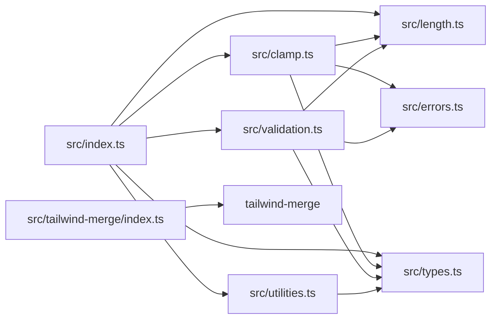

# Codebase Map

## Source Dependencies

## File Responsibilities

| File | Responsibility | Common Dependents |
| --- | --- | --- |
| `src/index.ts` | Plugin registration, option normalization, exports. | Tests, package root consumers. |
| `src/clamp.ts` | Clamp math, fluid string parsing, theme value resolution, accessibility checks. | `src/index.ts`, tests. |
| `src/length.ts` | CSS length parsing and conversion. | `src/clamp.ts`, `src/validation.ts`, tests. |
| `src/utilities.ts` | Utility-to-CSS-property mapping and default scales. | `src/index.ts`, tests, docs. |
| `src/validation.ts` | Unit/value/breakpoint validation. | `src/index.ts`, tests. |
| `src/errors.ts` | Typed errors and result helpers. | `src/clamp.ts`, `src/validation.ts`, tests. |
| `src/types.ts` | Shared TypeScript interfaces. | Most source files and consumers through exports. |
| `src/tailwind-merge/index.ts` | Merge validators and class group config. | Subpath consumers, tests. |

## Dependency Awareness Rules

Before editing:

- `src/utilities.ts`: check `src/index.ts`, `src/tailwind-merge/index.ts`, and tests.
- `src/clamp.ts`: check clamp, validation, advanced feature, and performance tests.
- `src/index.ts`: check plugin registration tests and package exports.
- `src/tailwind-merge/index.ts`: check merge tests and README examples.
- `package.json`: check `tsup.config.ts`, `README.md`, and generated package expectations.
- `homepage/src/*`: check adjacent components and `homepage/src/index.css` for plugin usage.
